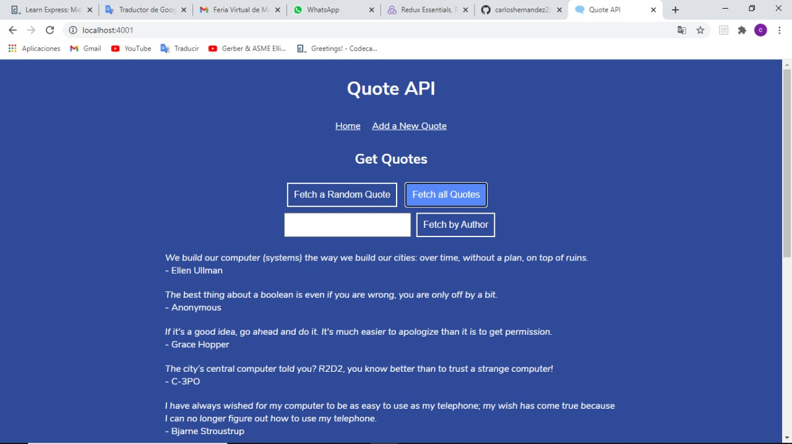

# Project Name

> Quote API.

## Table of contents

- [Project Name](#project-name)
  - [Table of contents](#table-of-contents)
  - [General info](#general-info)
  - [Screenshots](#screenshots)
  - [Technologies](#technologies)
  - [Setup](#setup)
  - [Code Examples](#code-examples)
  - [Features](#features)
  - [Status](#status)
  - [Inspiration](#inspiration)
  - [Contact](#contact)

## General info

The purpose of the proyect was to make an API server that responded to AJAX requests from the browser.

## Screenshots

Background image screenshot:



## Technologies

- CSS
- HTML
- Express.js

## Setup

- Clone the repo
- navigate to the folder on your text editor
- run npm install
- run node server.js
- open your browser and navigate to <http://localhost:4001/>

## Code Examples

Example of usage:

```javascript
const express = require('express');
const app = express();

const { quotes } = require('./data');
const { getRandomElement } = require('./utils');

const PORT = process.env.PORT || 4001;

app.use(express.static('public'));

app.get('/api/quotes/random', (req, res) => {
    const element = getRandomElement(quotes);
    const response = {
        quote: element
    };
    res.send(response);
})

app.get('/api/quotes', (req, res) => {
    const response1 = {
        quotes: quotes
    };
    if (!req.query.person) {
        res.send(response1);
    } else {
        let prepare = quotes.filter(obj => obj.person===req.query.person);
        const response2 = {
            quotes: prepare
        }
        res.send(response2);
    }
})

app.post('/api/quotes', (req, res) => {

    if (!req.query.person || !req.query.quote) {
        res.status(400).send();
    } else {
        const response2 = {
            quote: {
                quote: req.query.quote,
                person: req.query.person
            }
        }
        quotes.push(response2.quote);
        res.send(response2);
    }
})

app.listen(PORT);
```

## Features

List of features:

- AJAX requests
- GET and POST methods to interact with API

## Status

Project is: Finished.

## Inspiration

I was motivated by my desire to learn back-end programming.

## Contact

Created by [@CarlosHernández](https://linkedin.com/in/carlos-manuel-hernández-consuegra-42975a189) - feel free to contact me!
